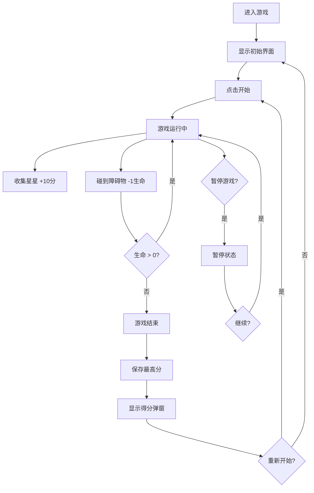

## 1. 产品概述

"星星收集者"是一款轻量级前端休闲小游戏，玩家通过键盘或触屏控制角色在固定大小的星空地图中移动，收集随机出现的星星获得分数，同时躲避障碍物保护生命值。

- 目标用户：休闲游戏爱好者、前端技术学习者
- 核心价值：提供轻松有趣的休闲体验，代码结构具备良好的可扩展性，便于后续迭代新功能

## 2. 核心 Features

### 2.1 User Roles

| 角色 | 注册方式 | 核心权限 |
|------|----------|----------|
| 玩家 | 无需注册 | 游戏游玩、查看分数、保存最高分 |

### 2.2 Feature Module

1. **游戏主界面**：游戏画布、状态面板、控制按钮
2. **角色控制系统**：键盘方向键/WASD控制、触屏虚拟摇杆
3. **道具生成系统**：星星（加分）、障碍物（扣血）的随机生成与管理
4. **状态管理系统**：开始、暂停、重新开始、游戏结束
5. **分数系统**：实时分数、最高分本地存储、生命值显示

### 2.3 Page Details

| 页面名称 | 模块名称 | 功能描述 |
|---------|----------|----------|
| 游戏主页面 | 游戏画布 | 渲染星空背景、角色、星星、障碍物 |
| 游戏主页面 | 顶部状态栏 | 显示当前分数、最高分、生命值 |
| 游戏主页面 | 控制按钮区 | 开始/暂停/重新开始按钮 |
| 游戏主页面 | 移动端控制区 | 触屏设备显示虚拟方向键 |
| 游戏主页面 | 游戏结束弹窗 | 显示最终得分、最高分、重新开始选项 |

## 3. Core Process

玩家进入游戏 → 点击开始按钮 → 角色出现在地图中心 → 控制角色移动收集星星加分 → 躲避障碍物避免扣血 → 生命值归零游戏结束 → 显示最终得分并保存最高分 → 可选择重新开始

## 4. User Interface Design

### 4.1 Design Style
- **主色调**：深邃星空蓝 `#0a0e27` 作为背景，配合紫色 `#6366f1` 和金色 `#fbbf24` 作为强调色
- **按钮风格**：圆润半透明玻璃态按钮，带有柔和发光效果
- **字体**：使用 `Orbitron`（数字显示）+ `Noto Sans SC`（中文文本），营造太空科技感
- **布局**：居中对称布局，游戏画布为视觉焦点，状态栏在顶部，控制按钮在底部
- **视觉效果**：星星闪烁动画、角色拖尾效果、碰撞发光反馈

### 4.2 Page Design Overview

| 页面名称 | 模块名称 | UI Elements |
|---------|----------|-------------|
| 游戏主页面 | 游戏画布 | 深色星空背景 + 闪烁星点，角色发光圆形，星星金色星形，障碍物红色陨石形 |
| 游戏主页面 | 顶部状态栏 | 半透明深色条，左中右分别显示生命值、分数、最高分 |
| 游戏主页面 | 控制按钮 | 玻璃态按钮，开始为绿色系，暂停为黄色系，重新开始为蓝色系 |
| 游戏主页面 | 结束弹窗 | 居中半透明深色卡片，带有模糊背景效果 |
| 游戏主页面 | 移动端控制 | 虚拟方向键，四角布局，半透明圆形按钮 |

### 4.3 Responsiveness
- 桌面端：固定尺寸游戏画布 800x600，键盘控制为主
- 移动端：自适应屏幕尺寸，最大宽度 100vw - 40px，显示虚拟方向键支持触屏操作
- 所有UI元素使用rem单位，确保在不同设备上显示一致

## 5. 扩展性设计

当前版本为单人闯分模式，代码架构预留以下扩展点：
- **关卡系统**：可配置不同难度参数（生成速度、地图大小、障碍物数量）
- **道具系统**：支持新增道具类型（加速、护盾、双倍分数等）
- **敌人系统**：可加入主动移动的敌人角色
- **成就系统**：预留成就检测和解锁接口
- **音效系统**：预留音效播放接口
