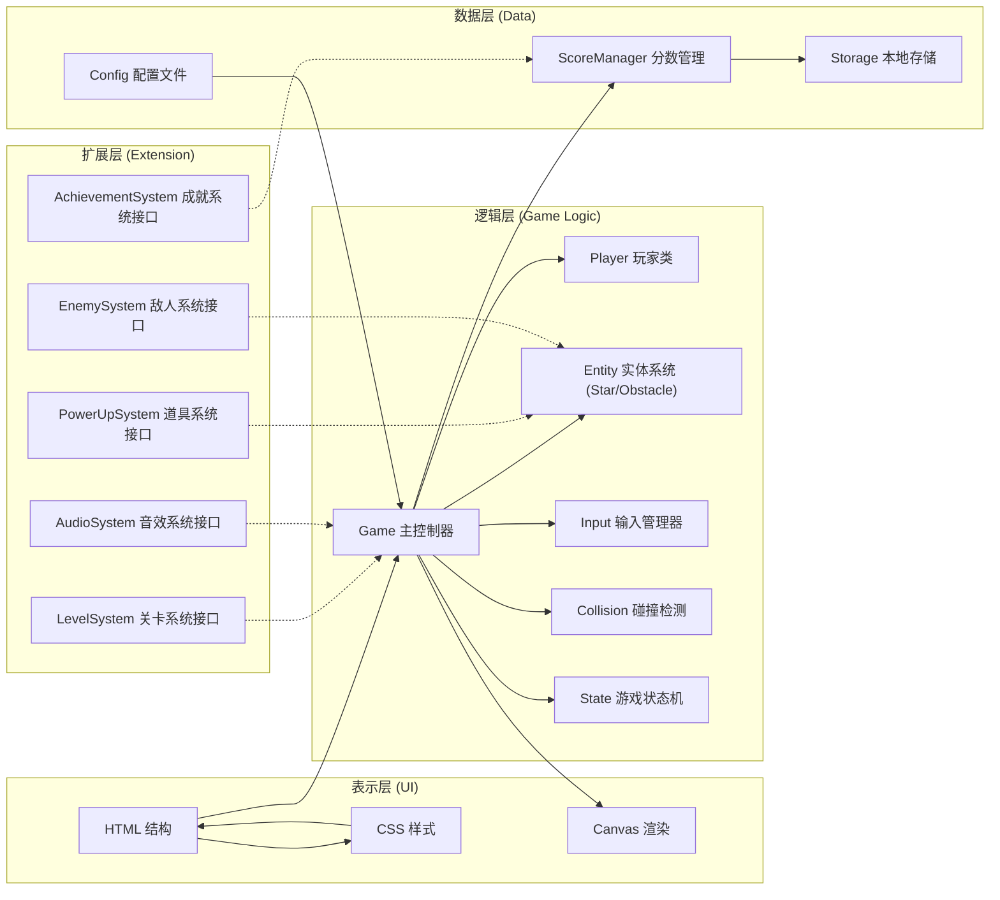
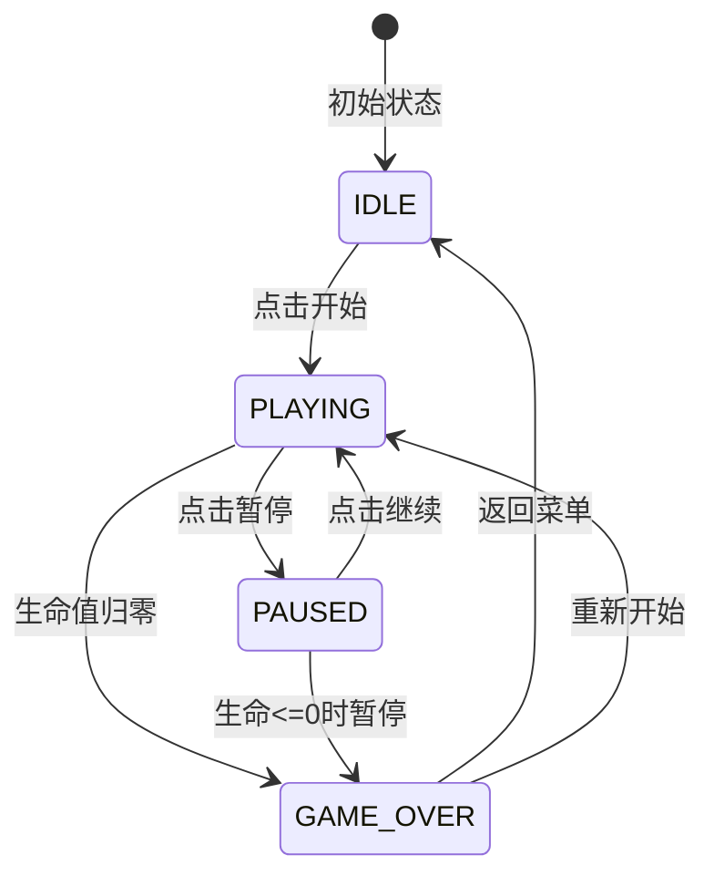

## 1. Architecture Design



## 2. Technology Description

- **前端技术栈**：原生 HTML5 + CSS3 + JavaScript (ES6+)
- **渲染方式**：HTML5 Canvas 2D
- **构建工具**：无需构建工具，直接浏览器运行
- **样式方案**：CSS3 变量 + Flexbox 布局，配合玻璃态效果
- **数据存储**：浏览器 localStorage
- **字体方案**：Google Fonts (Orbitron + Noto Sans SC)
- **图标方案**：纯 CSS 绘制 + Unicode 字符，无需额外图标库

### 技术选型理由：
1. 原生开发确保最小化体积，无构建依赖
2. Canvas 2D 提供流畅的游戏渲染性能
3. CSS3 变量便于主题定制和响应式调整
4. 模块化ES6类结构便于后续功能扩展
5. localStorage 实现最高分持久化，无需后端

## 3. Project Structure

```
xzwl-10/
├── index.html              # 游戏主页面
├── css/
│   └── style.css           # 全局样式
├── js/
│   ├── config.js           # 游戏配置参数
│   ├── game.js             # 游戏主控制器
│   ├── player.js           # 玩家类
│   ├── entities.js         # 实体类（星星、障碍物基类）
│   ├── input.js            # 输入管理器
│   ├── collision.js        # 碰撞检测
│   ├── storage.js          # 本地存储管理
│   ├── score.js            # 分数管理
│   └── main.js             # 入口文件
└── .trae/
    └── documents/
        ├── prd-星星收集者.md
        └── tech-星星收集者.md
```

## 4. Core Class Definitions

### 4.1 Game 主控制器
```javascript
class Game {
  constructor(canvas, config) { /* 初始化游戏 */ }
  init() { /* 初始化所有系统 */ }
  start() { /* 开始游戏 */ }
  pause() { /* 暂停游戏 */ }
  resume() { /* 继续游戏 */ }
  restart() { /* 重新开始 */ }
  gameOver() { /* 游戏结束处理 */ }
  update() { /* 游戏主循环更新 */ }
  render() { /* 游戏主循环渲染 */ }
  // 扩展接口
  registerLevelSystem(system) { /* 注册关卡系统 */ }
  registerPowerUpSystem(system) { /* 注册道具系统 */ }
  registerEnemySystem(system) { /* 注册敌人系统 */ }
  registerAchievementSystem(system) { /* 注册成就系统 */ }
  registerAudioSystem(system) { /* 注册音效系统 */ }
}
```

### 4.2 Player 玩家类
```javascript
class Player {
  constructor(x, y, config) { /* 初始化玩家 */ }
  move(dx, dy) { /* 移动逻辑 */ }
  update() { /* 更新状态 */ }
  render(ctx) { /* 渲染玩家 */ }
  getBounds() { /* 获取碰撞边界 */ }
  takeDamage(amount) { /* 受到伤害 */ }
  heal(amount) { /* 恢复生命 */ }
}
```

### 4.3 Entity 实体基类
```javascript
class Entity {
  constructor(type, x, y, config) { /* 初始化实体 */ }
  update() { /* 更新实体状态 */ }
  render(ctx) { /* 渲染实体 */ }
  getBounds() { /* 获取碰撞边界 */ }
  onCollide(target) { /* 碰撞回调 */ }
}

class Star extends Entity { /* 星星类，继承Entity */ }
class Obstacle extends Entity { /* 障碍物类，继承Entity */ }
// 扩展：class PowerUp extends Entity {}
// 扩展：class Enemy extends Entity {}
```

### 4.4 InputManager 输入管理
```javascript
class InputManager {
  constructor() { /* 初始化输入监听 */ }
  onKeyDown(callback) { /* 键盘按下回调 */ }
  onKeyUp(callback) { /* 键盘松开回调 */ }
  onTouchStart(callback) { /* 触屏开始回调 */ }
  onTouchMove(callback) { /* 触屏移动回调 */ }
  getDirection() { /* 获取当前移动方向 */ }
}
```

### 4.5 CollisionDetector 碰撞检测
```javascript
class CollisionDetector {
  static checkCircle(a, b) { /* 圆形碰撞检测 */ }
  static checkRect(a, b) { /* 矩形碰撞检测 */ }
  static checkBounds(entity, bounds) { /* 边界检测 */ }
}
```

### 4.6 ScoreManager 分数管理
```javascript
class ScoreManager {
  constructor(storage) { /* 初始化分数系统 */ }
  addScore(points) { /* 增加分数 */ }
  getScore() { /* 获取当前分数 */ }
  getHighScore() { /* 获取最高分 */ }
  saveHighScore() { /* 保存最高分 */ }
  reset() { /* 重置分数 */ }
}
```

## 5. Game State Machine



## 6. Configuration Parameters

```javascript
// config.js 核心配置
const CONFIG = {
  game: {
    canvasWidth: 800,
    canvasHeight: 600,
    fps: 60,
    initialLives: 3,
    backgroundStars: 100
  },
  player: {
    size: 20,
    speed: 5,
    color: '#6366f1',
    trailLength: 10
  },
  star: {
    size: 15,
    points: 10,
    spawnInterval: 1500,
    maxCount: 5,
    color: '#fbbf24'
  },
  obstacle: {
    size: 25,
    damage: 1,
    spawnInterval: 2000,
    maxCount: 3,
    color: '#ef4444',
    speed: 2
  },
  storage: {
    highScoreKey: 'starCollector_highScore'
  },
  // 扩展配置预留
  levels: [/* 关卡配置 */],
  powerUps: [/* 道具配置 */],
  achievements: [/* 成就配置 */]
};
```

## 7. Data Model

### 7.1 本地存储结构
```javascript
// localStorage 存储
{
  "starCollector_highScore": number,  // 最高分
  // 扩展预留
  "starCollector_achievements": [],   // 已解锁成就
  "starCollector_settings": {}        // 游戏设置
}
```

### 7.2 游戏运行时状态
```javascript
{
  state: 'idle' | 'playing' | 'paused' | 'gameover',
  score: number,
  lives: number,
  level: number,
  player: { x, y, size },
  entities: [/* 活跃实体列表 */],
  spawnTimers: { /* 生成计时器 */ }
}
```
